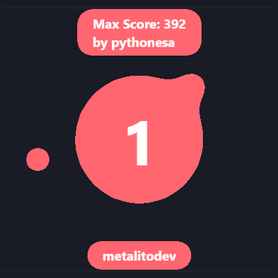

# Numerica Rothio Skin

This is a Re-Skin of the original [Numerica](https://github.com/rothiotome/numerica-twitch) game developed by [RothioTome](https://github.com/rothiotome)

## How to Play:

Numerica is a minigame created by Rothio Tome and designed for use on Twitch.  
The objective is simple: reach the highest score possible.

- Each time a viewer types a number, the counter will increase. 
- If a viewer types the wrong number, the counter will restart.
- A viewer can't type two consecutive numbers.

And that's it

## It looks like this:

